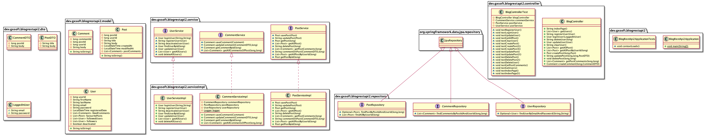

# **WEEK 9 BLOG REST API SpringBootApplication**

This is a REST API backend application built using Java, Spring boot and Postgresql which gives functionality 
to register user, logIn user, get all User, deactivate user, add post, delete post, update post, add comment 
and delete comment in post.
---
## REQUEST STRUCTURE

### To view All posts created by a certain user
- RequestMethod: **GET**
- RequestURL: http://localhost:8081/blog/api/{userId}/posts/

###To add a user in the system
RequestMethod: **POST**
URL: http://localhost:8081/blogApplication/addUser

Request Body :
```json
            {
                "firstName" : "<firstName>",
                "lastName" : "<lastName>",
                "email" : "<email>",
                "password" : "<password>",
                "dateOfBirth" : "<date of birth>"
            }
```

### To view All posts stored in the database

- RequestMethod: **GET**
- RequestURL: http://localhost:8081/blog/api/posts

### To create a post

- RequestMethod: **POST**
- RequestURL: http://localhost:8081/blog/api/{userId}/posts/

```json
            {
              "userId": "{userId}",
              "title": "{title}",
              "body": "{body}"
            }
```

##To add a post in the database by a user already registered
method: POST
URL: http://localhost:8081/blog/api/addPost/{userid}

*Request Body:*
```json
            {
                "title" : "${title}",
                "description" : "${description}",
                "body" : "${body of the post}",
                "type" : "${TECH/FASHION/EDUCATION/ADVENTURE}"
            }
```

** To add comment in a post
method: POST
URL: http://localhost:8081/blogApplication/posts/{id}/comment

Request Body :
```json
            {
                "postId" : "${postId}",
                "userId" : "${userID}",
                "text" : "${comment body}"
            }
```

## To delete a post
RequestMethod: **DELETE**
RequestURL: http://localhost:8081/blogApplication/posts/{id}


## UML DIAGRAMS


